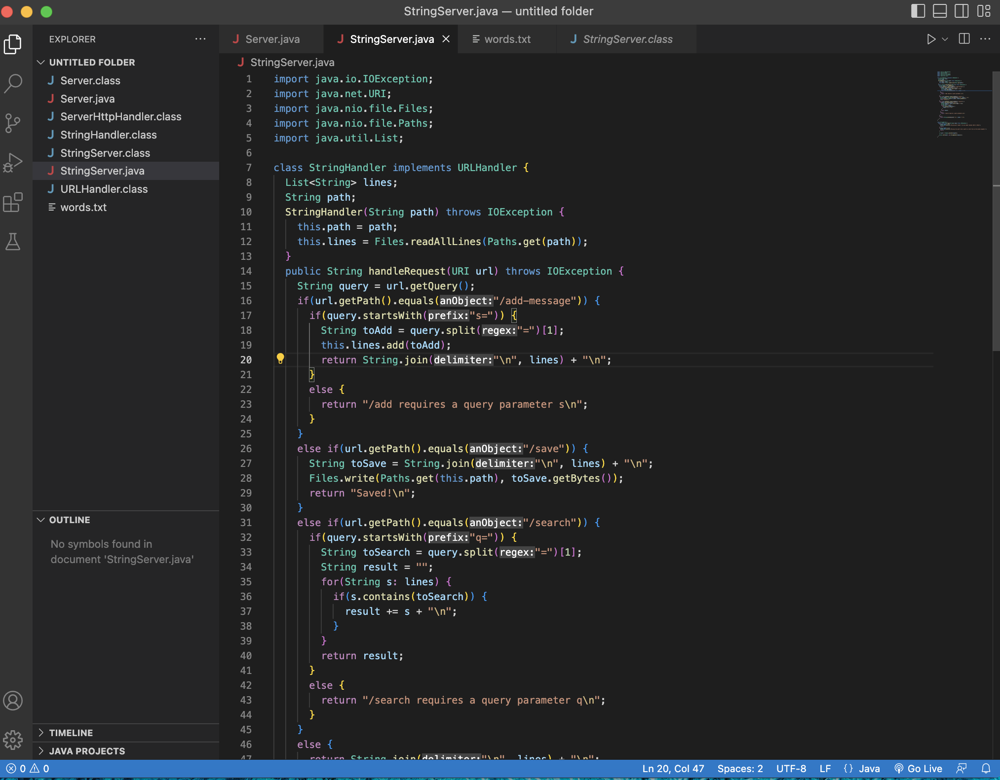
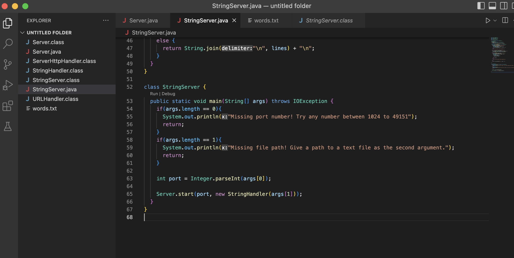
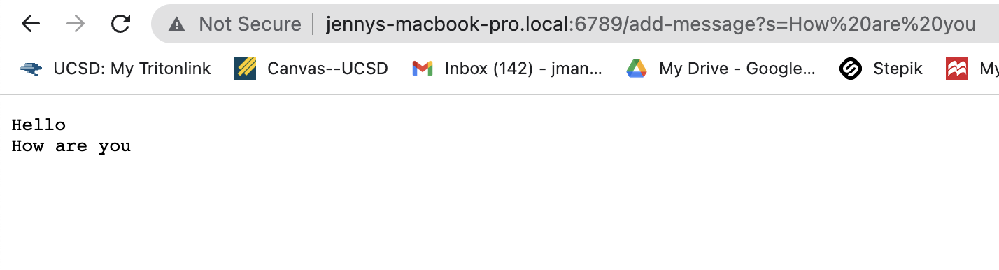
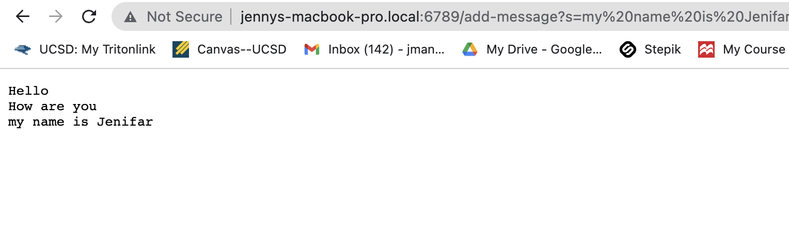
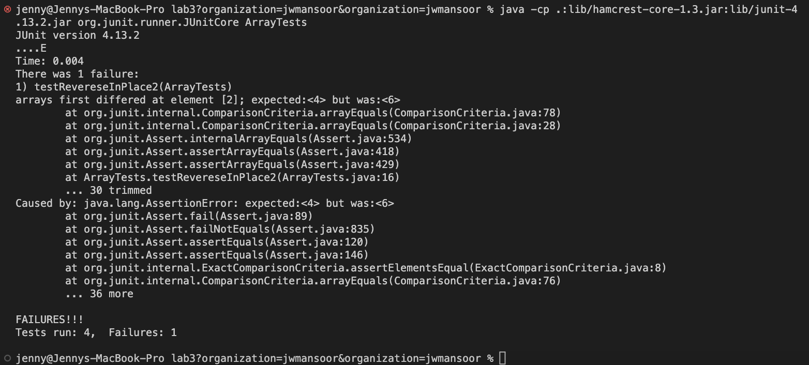
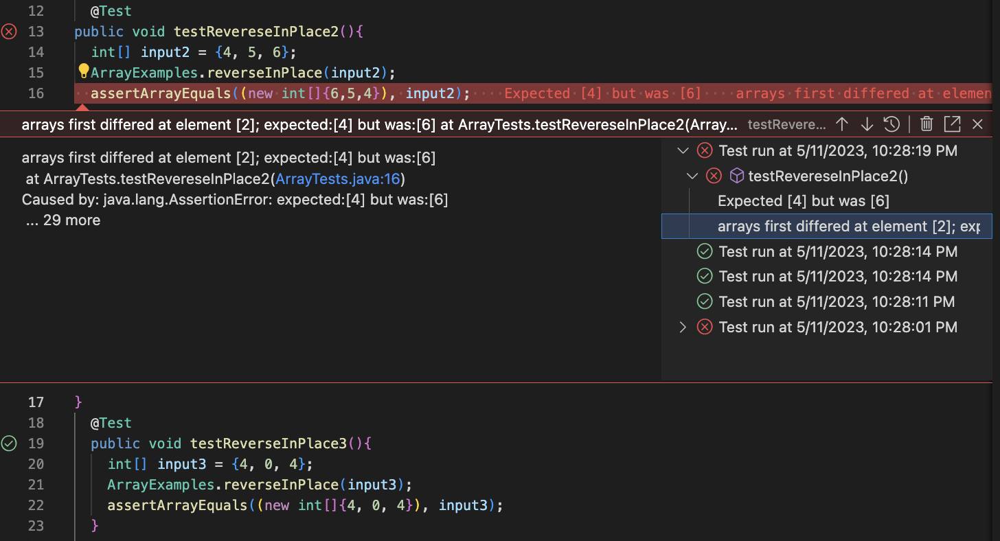

# Lab Report 2: Servers and Bugs


## Part 1: String Server
My code for `StringServer.java` is shown below. I used the docsearch repository as a reference. 



## Using `/add-message`
**The screenshots below show me using `add-message` in the url, and getting the expected result.**
1. 
* When I run `StringServer.java`, the methods that get called are: `handleRequest()` and `main()`. Within these methods, other methods get called like `getPath()`, `getQuery()`, `contains()`, `add()`, `join()`, `split()`, `startsWith()`, etc., which are defined by java in the code that we imported. 
  * The relevant argument to `handleRequest` is a `URI` (the url we get when we start the server). 
  * The relevant arguments to `main()` is the `port number`(int) and the `file path`(.txt file). 
* The relevant field that gets changed is `lines` because it gets updated with the string that we just added through `add-message`. `lines` is a list of strings, `List <String>` that contains strings seperated by `/n`. When we use `add-message?s=<string>`, we concatenate the string that we entered to `lines` and return lines on the screen. 

2. 
* Likewise, when I run `StringServer.java`, the methods that get called are: `handleRequest()` and `main()`.  
  * The relevant argument for 'handleRequest` is a URI, and the ones for`main()` are the `port number` and `file path`. If we run main without the two arguments, then we will get an exception telling us we re missing one of the argument. 
* The relevant field that gets changed is, again, `lines` because it gets updated with the string that we just added through `add-message`.

## Part 2: Bugs
The bug I chose from lab 3 was from `ArrayExamples.java`, and it was in the `reverseInPlace` method. 


**A Failure Inducing Input:** 
``` 
@Test 
public void testRevereseInPlace2(){
  int[] input2 = {4, 5, 6}; 
  ArrayExamples.reverseInPlace(input2);
  assertArrayEquals((new int[]{6,5,4}), input2);
}
```

**A Successful Input:**
```
@Test
public void testReverseInPlace3(){
  int[] input3 = {4, 0, 4};
  ArrayExamples.reverseInPlace(input3);
  assertArrayEquals((new int[]{4, 0, 4}), input3);
}
```

**Symptoms:** 




**The Bug Before:**
```
static void reverseInPlace(int[] arr) {
  for(int i = 0; i < arr.length; i += 1) {
    arr[i] = arr[arr.length - i - 1];
  }
}
```

**The (Fixed) Bug After:**
```
static void reverseInPlace(int[] arr) {
  int sub;
  for(int i = 0; i < arr.length/2; i += 1) {
    sub = arr[i];
    arr[i] = arr[arr.length - i - 1];
    arr[arr.length - i - 1] = sub;
  }
}
```
I started off by dividing the arr.length by 2, because in that way, the list can reverse correctly and we won't change the middle value in the array (if there is one). Then, I created a local varibale, `sub`, and assigned the value of `sub` with the value stored in `arr[i]`. Then, I stored the value of sub in the value opposite of `arr[i]`, to reverse those values utilizing the for loop in our code. This will allow me to automatically reverse the list. 

## Part 3: Learning Reflection
I find that I learn best when I try things myself and do hands-on activities, and that is why I appreciate the labs in this class. In week 2, we did a lab with web servers, which was still pretty new to me. I did not know that I could access in my terminal the same thing I accessed in my browser using the `curl` command. This is cool because sometimes I don't want to go back and forth between my code and browser, so knowing that I can do it right from the command line will help me be more efficient. The `curl` command takes an https: `url` as an argument and prints out what it has access to right in the terminal. It can also load URLs for a server, such as ieng-6. In week 3, I learned alot about debugging and the importance of debugging, which I was not taught before. That will help me get through CSE 12 and the rest of my coding journey. Overall, I learned alot the last two weeks in lab, and the things I described are the ones that stuck out to me the most!
