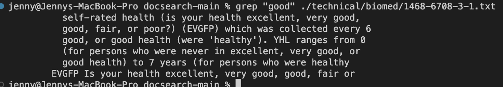
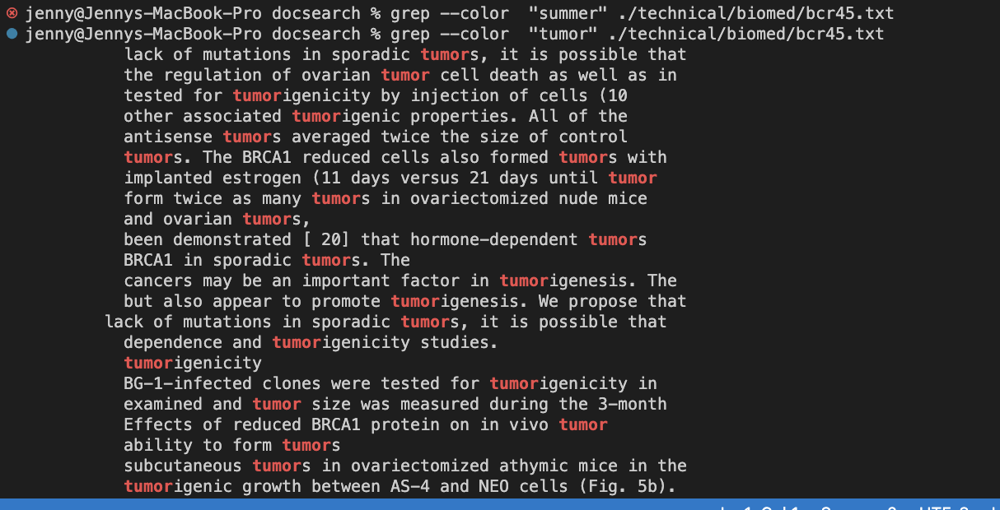
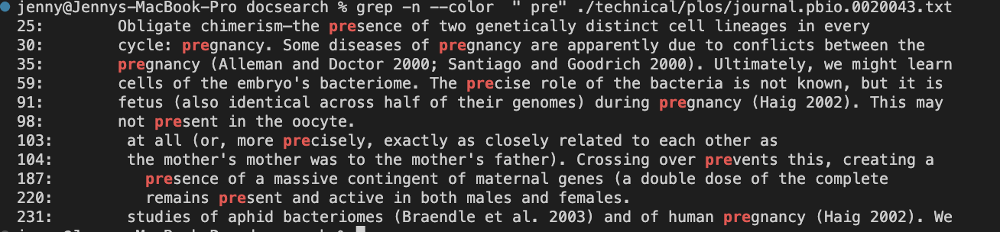
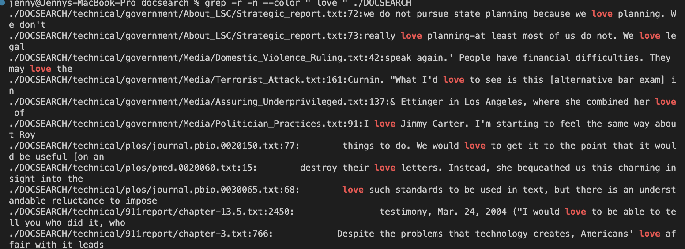

# Lab Report 3: Researching Commands 
For this lab report, I chose to research four different ways to use the command `grep` in my terminal. I used [ChatGPT](https://openai.com/blog/chatgpt) and [digitalocean.com](https://www.digitalocean.com/community/tutorials/grep-command-in-linux-unix) to help me generate command-line options. The specific prompt I gave ChatGPT was "find different ways to use grep in my terminal."  It came up with a bunch of different options and I chose four of the most interesting/useful ones. For each of my options, I gave examples from the subdirectories and files in `./technical` as well as cited my sources.  

## The Basic `grep` Command: 
**`$ grep "string" file-name.txt`**
* The `grep` command takes two arguments: a `string` (that you want to search for), and a `file` (that you are searching in). It then looks for the specified `string` in the specified `file` and prints out all of the lines that contain that string right in the terminal.
    * 
    * For example, I used the `grep` command here to search for the string `good` in the file `./technical/biomed/1468-6708-3-1.txt` by typing in `grep "good" ./technical/biomed/1468-6708-3-1.txt`. It printed out all of the lines containing `"good"` in my terminal. Below are some modifications to this command that allow us to do different things with the `grep` command.

## Option 1: 
**`$ grep -r "string" directory-name/`**
* This command allows us to search recursively for a `string` in all of the files and subdirectories of a directory. This means that by adding the flag `-r` to the `grep` command, we are telling it to search for that `string` in the whole directory instead of a specific file. As a result, the file name along with the line containing that `string` gets printed out in the terminal. 
* This command can be very useful when we don't know what specific file to search in. 
       *Additionally, if we want to search in our current directory, we can also try `grep -r "string-name" *`
* Source: [ChatGPT](https://openai.com/blog/chatgpt)

**Example 1:** 
```
jenny@Jennys-MacBook-Pro docsearch % grep -r " love " ./DOCSEARCH

./docsearch/technical/government/About_LSC/Strategic_report.txt:we do not pursue state planning because we love planning. We don't
./docsearch/technical/government/About_LSC/Strategic_report.txt:really love planning-at least most of us do not. We love legal
./docsearch/technical/government/Media/Domestic_Violence_Ruling.txt:speak again.' People have financial difficulties. They may love the
./docsearch/technical/government/Media/Terrorist_Attack.txt:Curnin. "What I'd love to see is this [alternative bar exam] in
./docsearch/technical/government/Media/Assuring_Underprivileged.txt:& Ettinger in Los Angeles, where she combined her love of
./docsearch/technical/government/Media/Politician_Practices.txt:I love Jimmy Carter. I'm starting to feel the same way about Roy
./docsearch/technical/plos/journal.pbio.0020150.txt:        things to do. We would love to get it to the point that it would be useful [on an
./docsearch/technical/plos/pmed.0020060.txt:        destroy their love letters. Instead, she bequeathed us this charming insight into the
./docsearch/technical/plos/journal.pbio.0030065.txt:        love such standards to be used in text, but there is an understandable reluctance to impose
./docsearch/technical/911report/chapter-13.5.txt:                testimony, Mar. 24, 2004 ("I would love to be able to tell you who did it, who
./docsearch/technical/911report/chapter-3.txt:            Despite the problems that technology creates, Americans' love affair with it leads 
```
* ❤️ This command is useful for cases like this, where we want to find all of the files that contain the string ` "love" ` inside the directory `./DOCSEARCH' 
* ❤️ `grep -r` prints all of the file names that have `"love"` in them along the lines that contain `"love"` in those files. 

**Example 2:**
```
jenny@Jennys-MacBook-Pro docsearch % grep -r "tofu" ./DOCSEARCH

./docsearch/technical/biomed/bcr285.txt:          consumed in Hawaii: tofu, fried tofu, pressed tofu, green
./docsearch/technical/biomed/bcr285.txt:          soybeans, miso, soybean sprouts, tofu skin, soy
./docsearch/technical/biomed/bcr285.txt:          same was true for tofu intake from the SQ and the FFQ:
./docsearch/technical/biomed/bcr285.txt:          means of tofu intake for each ethnic group, as estimated
./docsearch/technical/biomed/bcr285.txt:          products, miso, tofu skin, Western vegetarian meats, and
./docsearch/technical/biomed/bcr285.txt:        reported eating tofu more than once a week as compared with
./docsearch/technical/biomed/bcr285.txt:        women who ate tofu less than once a month. In a study from
./docsearch/technical/biomed/bcr285.txt:          food items, one each for tofu and Western vegetarian
./docsearch/technical/biomed/bcr285.txt:          soy foods commonly consumed in Hawaii: tofu, fried tofu,
./docsearch/technical/biomed/bcr285.txt:          pressed tofu, green soybeans, miso, soybean sprouts, tofu
./docsearch/technical/biomed/bcr285.txt:          same was true for tofu intake from the SQ and the FFQ:
./docsearch/technical/biomed/bcr285.txt:          means of tofu intake as estimated from the two dietary
./docsearch/technical/biomed/bcr285.txt:          products, miso, tofu skin, Western vegetarian meats, and
./docsearch/technical/biomed/1471-2202-2-20.txt:        phytoestrogens, consumed as tofu, have an adverse influence
./docsearch/technical/biomed/1471-2202-2-20.txt:        high tofu levels [ 44 ] . However, while it is important to
jenny@Jennys-MacBook-Pro docsearch % 
```
* 🍱 In this example, the `grep -r` command is searching for the string `"tofu"` in all files of the directory `./DOCSEARCH` and printing the `filename + the line in which "tofu"` appears in. Apparently, there are two files that have `tofu` in them, `biomed/bcr285.txt` and `biomed/1471-2202-2-20.txt`. 
* 🍱 This is useful because I knew I had seen `tofu` somewhere in this directory, but I wasn't sure which file it was in. This version of the `grep` command allowed me to see exactly where `tofu` appears. I can see how important this command is when searching for a `string` in a large dataset directory. 


## Option 2: 
**`$ grep --color "string" file-name.txt`**
* When we add `--color` to the grep command and run it in our terminal, it prints out all of the lines containing the specified `string` in the specifed `file.txt` **AND colors that `string` red.**
* Source: [digitalocean.com](https://www.digitalocean.com/community/tutorials/grep-command-in-linux-unix)

**Example 1:**

`$ grep --color "tumors" ./technical/biomed/bcr45.txt`


* **Markdown doesn't have a built-in method for changing text colors, so I provided an image of the output in [Visual Studio Code] (https://code.visualstudio.com/) instead of a `code-block`.**
*  In this example, `grep --color` searches for the string `tumors` in the file `bcr45.txt`, prints out the lines containing it, and changes the color of every string `tumors` to red. This is useful because it makes it easy to see where the `string` we are looking for is exactly located. It basically points out that `string` by changing its color to red. 
 
**Example 2:**

`$ grep --color "summer" ./technical/plos/journal.pbio.0020053.txt`

* **Markdown doesn't have a built-in method for changing text colors, so I provided an image of the output in [Visual Studio Code] (https://code.visualstudio.com/) instead of a `code-block`.**
* Since there is only one line that contains the string `summer` in this file, that line is printed out with `summer` in red. `grep --color` changes the color of the string `summer` to red to make it easier for us to find where it is on that line. This can be very useful when we have multiple lines that contain the `string` we are searching for because it makes it easier to see the exact occurance of it, such as our ouput in example 1.

## Option 3: 
**`$ grep -n "string" file-name.txt`**
* This command searches for the specified `string` in the `file`, and prints all of the lines that contain that `string` **AS WELL AS THE NUMBER of those LINES in the order of which they first appear.**
* This can be useful because it allows us to identify where a `string` is located easily by giving us the number of the line it appears in. So when we go back to the file, we know exactly which line it appears in and can go back to it. 
* Source: [digitalocean.com](https://www.digitalocean.com/community/tutorials/grep-command-in-linux-unix)

**Example 1:**
```
jenny@Jennys-MacBook-Pro docsearch % grep -n  "tumor" ./technical/biomed/bcr45.txt
20:          lack of mutations in sporadic tumors, it is possible that
57:          the regulation of ovarian tumor cell death as well as in
95:          tested for tumorigenicity by injection of cells (10
124:          other associated tumorigenic properties. All of the
138:          antisense tumors averaged twice the size of control
139:          tumors. The BRCA1 reduced cells also formed tumors with
141:          implanted estrogen (11 days versus 21 days until tumor
160:          form twice as many tumors in ovariectomized nude mice
180:          and ovarian tumors, 
184:          been demonstrated [ 20] that hormone-dependent tumors
188:          BRCA1 in sporadic tumors. The
208:          cancers may be an important factor in tumorigenesis. The
212:          but also appear to promote tumorigenesis. We propose that
245:        lack of mutations in sporadic tumors, it is possible that
360:          dependence and tumorigenicity studies.
428:          tumorigenicity
439:          BG-1-infected clones were tested for tumorigenicity in
451:          examined and tumor size was measured during the 3-month
588:          Effects of reduced BRCA1 protein on in vivo tumor
592:          ability to form tumors 
595:          subcutaneous tumors in ovariectomized athymic mice in the
603:          tumorigenic growth between AS-4 and NEO cells (Fig. 5b).
604:          Almost twice as many sites were tumor positive for the
608:          positive tumor formation of the NEO sites (Fig. 5b, upper
609:          panel). AS-4 cells also formed tumors that averaged twice
610:          the size of NEO control tumors (Fig. 5b, lower
612:          BG-1 cells without matrigel were nontumorigenic in
615:          large, progressively growing tumors when injected with
617:          tumors were very large (>1cm diameter) and did not
621:          control clone were positive for tumor formation in the
622:          presence of estrogen. AS-4 cells formed tumors with half
625:          21 days until tumor formation). Neither AS-4 nor NEO
626:          cells formed progressively growing tumors in the absence
627:          of estrogen, however. All tumors in the mice without
629:          injection. The observed tumor regression was not
644:          BRCA1 functions as a tumor
664:          demonstrated other traits associated with a tumorigenic
669:          was examined for tumorigenicity compared with a control
671:          and larger tumors than NEO in the absence of estrogen,
672:          and in general formed tumors faster in the presence of
702:          deficient mice [ 41, 42]. In contrast, the tumors from
732:          independence and tumorigenicity is associated with 
807:          hormone-dependent tumors such as breast and ovarian
810:          breast and ovarian tumors, 
816:          BRCA1 in sporadic tumors.
818:          breast tumors in the promoter region of 
823:          important role in tumorigenesis. The present data suggest
826:          but appear to alter tumorigenesis. The exact mechanism
```
* In this example, `grep -n` finds **and numbers** all of the lines that have the string `"tumor"` in them in this file. This is useful because if I go back to the file, I know exactly what lines to look for and it will be so much easier to find `tumor`. In other words, this command makes my life easier. :) 

**Example 2:**
```
jenny@Jennys-MacBook-Pro docsearch % grep -n  " pre" ./technical/plos/journal.pbio.0020043.txt
25:        Obligate chimerism—the presence of two genetically distinct cell lineages in every
30:        cycle: pregnancy. Some diseases of pregnancy are apparently due to conflicts between the
35:        pregnancy (Alleman and Doctor 2000; Santiago and Goodrich 2000). Ultimately, we might learn
59:        cells of the embryo's bacteriome. The precise role of the bacteria is not known, but it is
91:        fetus (also identical across half of their genomes) during pregnancy (Haig 2002). This may
98:        not present in the oocyte.
103:        at all (or, more precisely, exactly as closely related to each other as
104:        the mother's mother was to the mother's father). Crossing over prevents this, creating a
187:          presence of a massive contingent of maternal genes (a double dose of the complete
220:          remains present and active in both males and females.
231:        studies of aphid bacteriomes (Braendle et al. 2003) and of human pregnancy (Haig 2002). We
jenny@Jennys-MacBook-Pro docsearch % 
```
* Here, I tried looking for the prefix `"-pre"` in this file, and `grep -n` gave me all of the lines that have the words stating with ` pre` as well as their line number. Now, if I back to this file, then I can easily find the lines containing words that start with `pre` by looking up the number given to me. The flag `-n` makes the grep command even more useful and efficient. 

## Option 4: 
**`grep -c "string" file-name.txt`**
* This option of `grep` prints out the number of occurences of the `string` we are looking for in that file. This can be useful if we are trying to see how many times a `string` appears in the file. 
* Source: [ChatGPT](https://openai.com/blog/chatgpt)

**Example 1:**
``` 
jenny@Jennys-MacBook-Pro docsearch % grep -c  "the" ./technical/plos/journal.pbio.0020043.txt
155
```
* In this example, I am searching for the number of times the word `"the"` appears in this file. As we can see,`"the"` appears 155 times in this file. 
* We can use this command to see whether or not a file contains a specific `string` easily. 

**Example 2:** 
```
jenny@Jennys-MacBook-Pro docsearch % grep -c  "hello" ./technical/plos/journal.pbio.0020043.txt
0
```
* Here, I searched for the number of times the word `"hello"` appears in this file. `grep -c` printed "0" because `hello` isn't anywhere in this file. If I want to check if a file contains a specific `string`, I can use this command to see how many times it appears. If the command returns 0, then I will know that the file doesn't contain that `string` obviously. 

## Some More Options:
**`grep '^character' file_name.txt`**
* This modification of `grep` searches for and prints all of the lines that start with the specified `character` in the file. There are many instances where this can be useful. 
* Source: [ChatGPT](https://openai.com/blog/chatgpt)

**Example 1:**
```
jenny@Jennys-MacBook-Pro docsearch % grep ^B  ./technical/911report/chapter-1.txt
Boarding the Flights
```
* Here, the command printed out the heading that starts with `"B"` because that is the only line starting with `"B"`.
* This is the only line that printed because the other lines in the file start with a space character, ` ` or a different character.  

**Example 2:**
```
jenny@Jennys-MacBook-Pro docsearch % grep ^U  ./technical/911report/chapter-1.txt
United Airlines Flight 175 
```
* In the same manner, this printed the heading starting with '"U"'. 

**`$ grep -v "string" file-name.txt`**
* This command will give us what's known as an invert output of `grep`, meaning it will print out all of the lines that don't contain the specified `string` in the file. This can be useful if we are trying to find a line that doesn't have the string we want.
* Source: [ChatGPT](https://openai.com/blog/chatgpt)

**Example**
```
jenny@Jennys-MacBook-Pro docsearch % grep -v "e" ./technical/biomed/bcr285.txt

  
    
      
        Synopsis
        
          Introduction
        
        
          Aims
        
        
        
        
          0.59-0.77) and κ 
          b = 0.009, 
          b = -0.06, 
          P = 0.002).
        
        
          Discussion
        
      
      
        Introduction
        10].
        Hawaii.
      
      
        
        
        
        
        
          Radiographic Digital Imaging, Compton, CA, USA) at a
        
        
          Statistical analysis
        
      
      
        
          (95% CI, 0.59-0.77) and κ 
        
        
        
        
          b = 0.009, 
          b = - 0.06, 
        
      
      
        Discussion
      
    
  
```
* This command basically gave me the result of all of the lines in the file `bcr285.txt` that don't have the string `e` in them, and our result is empty lines that have nothing but space characters or titles/headings that don't contain '"e"' in them. 


## Combined Modifications
* Here are some combined modifications that I found interesting. 

**`grep -n --color " pre" ./technical/plos/journal.pbio.0020043.txt`**

* This made my search for the prefix '" pre"' really efficient by displaying the lines along with their numbers and emphasizing the `string` we are looking for by changing its color to red. 

**`grep -r -n --color " love " ./DOCSEARCH`**

* This combines three modifications and allows us to search for the string easily in the directory `./DOCSEARCH`. 

